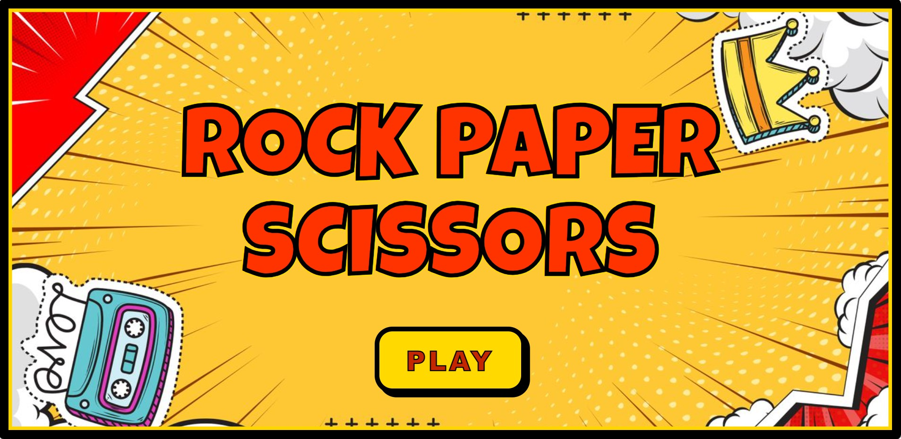
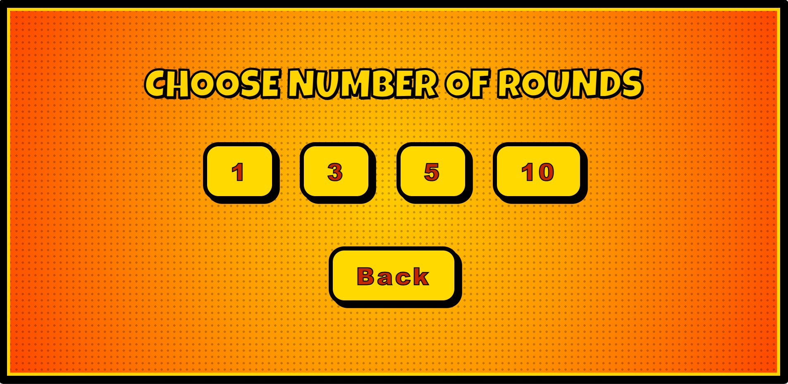
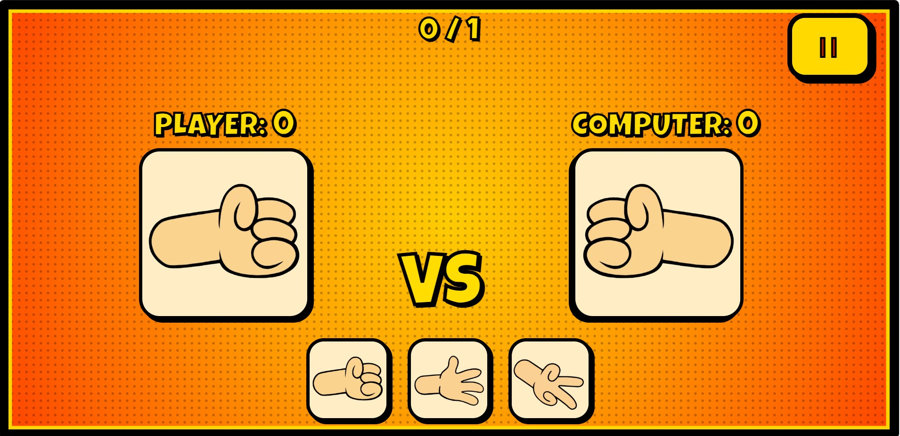
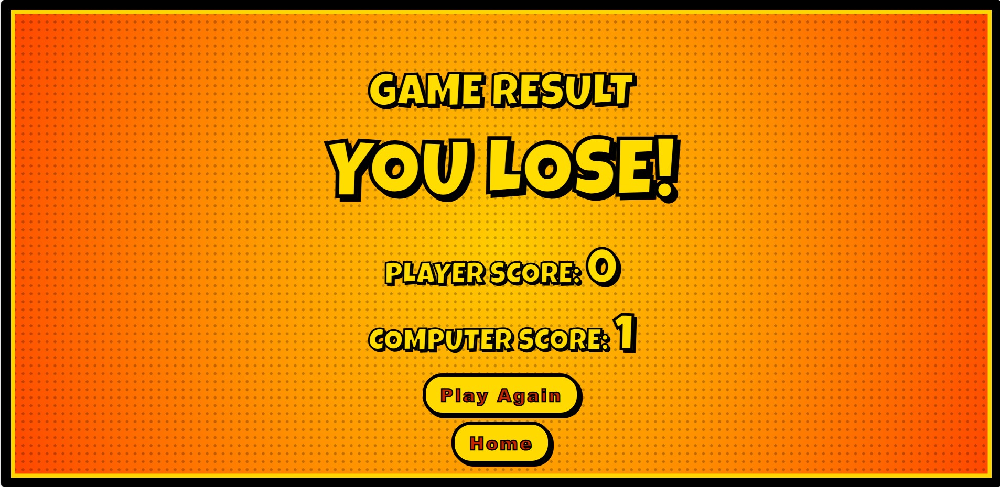

# Rock–Paper–Scissors Arcade Game
**Author:** Javier Caren 
**Course:** DC 101 – Web Development 
**Project Title:** Rock-Paper-Scissors Arcade Game 
**Mode:** Individual Work 

## Game Description

Comic Rock Paper Scissors is a browser-based interactive game inspired by the classic Rock–Paper–Scissors. The game features a comic-book visual style, sound effects, animated hand movements, and a round-based scoring system. Players compete against a computer opponent by selecting rock, paper, or scissors, with the final winner determined after a chosen number of rounds.

This project was developed as an original web-based game to demonstrate DOM manipulation, game logic, event handling, and UI interaction using HTML, CSS, and JavaScript.

## Technologies Used
This project was built using pure front-end technologies:
- **HTML** – Structure of the game
- **CSS** – Styling, layout, animations, and comic effects
- **JavaScript** – Game logic, scoring, countdown, event handling
- **Git & GitHub** – Version control and project hosting

## How to Play

1. Press the PLAY button.
2. Select the number of rounds (1, 3, 5, or 10)
3. Choose Rock, Paper, or Scissors by clicking the icons
4. A short countdown will play before each round
5. The computer randomly selects its move
6. Scores are updated after every round
7. After all rounds are completed, the final result screen is displayed

## How to Run the Game

Option 1: Play Online (GitHub Pages)

You can play the game anytime through the live link below:
🔗https://carenjavier328-hue.github.io/DC101_RPS_JavierCaren/

Option 2: Run Locally on Your Computer

## Download or clone the repository:
git clone https://github.com/carenjavier328-hue/DC101_RPS_JavierCaren.git

Open the project folder.
Double-click index.html to open it in your browser.

Start playing!

## Screenshots
### Home Screen

### Rounds Selection

### Gameplay

### Result Screen

## References
The following external resources were used and properly acknowledged:

Canvas Confetti Library – used for the confetti animation effect
Source: https://www.npmjs.com/package/canvas-confetti

Google Fonts – Luckiest Guy font
Source: https://fonts.google.com/specimen/Luckiest+Guy